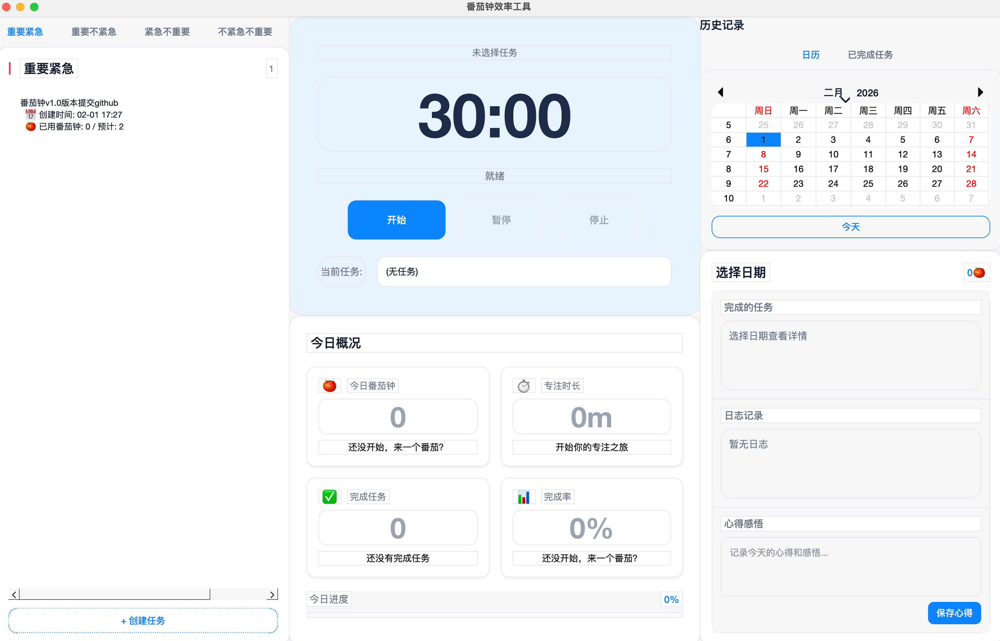

# 番茄钟效率工具 (Pomodoro Focus Pro)

[](https://www.python.org/)
[](https://www.riverbankcomputing.com/software/pyqt/)
[](LICENSE)

> 结合艾森豪威尔矩阵（四象限法则）与番茄工作法的 macOS 效率工具

## 功能特点

### 1. 四象限任务管理
- **重要紧急**（红色）、**重要不紧急**（黄色）、**紧急不重要**（蓝色）、**不紧急不重要**（灰色）
- 任务增删改查、拖拽移动、完成标记
- 完成清单自动记录任务持续天数和番茄钟消耗

### 2. 番茄钟执行器
- 30分钟倒计时（可自定义）
- 开始/暂停/停止/强制完成控制
- 任务联动：自动累计番茄钟数
- 独立线程运行，界面不卡顿

### 3. 历史记录与统计
- 日历视图：从 2026年1月 至今
- 日期详情：每日番茄钟、完成任务、待办统计
- 日志记录：支持关联任务

### 4. 响应式设计
- 宽屏模式（≥1400px）：三栏并列布局
- 中屏模式（<1400px）：智能压缩布局
- 自适应滚动：所有模块独立滚动
- 最小支持 1280×800 分辨率

## 技术栈

| 组件 | 技术 |
|------|------|
| GUI | PyQt6 6.6.1 |
| 数据库 | SQLite |
| 测试 | pytest 7.4.3 + pytest-qt 4.3.0 |
| 平台 | macOS (原生外观) |

## 快速开始

### 环境要求
- macOS 10.15+
- Python 3.9+
- 屏幕分辨率 ≥1280×800

### 安装

```bash
# 克隆项目
git clone https://github.com/NJU-Jet/Pomodoro-Focus-Pro.git
cd Pomodoro-Focus-Pro

# 创建虚拟环境
python3 -m venv venv
source venv/bin/activate

# 安装依赖
pip install -r requirements.txt
```

### 运行

```bash
# 启动应用
python main_responsive.py
```

## 项目结构

```
番茄钟_claude/
├── core/                    # 核心业务逻辑
│   ├── task_manager.py      # 任务管理（CRUD、象限逻辑）
│   ├── pomodoro_timer.py    # 番茄钟计时器
│   └── statistics.py        # 统计计算
├── data/
│   └── storage.py           # SQLite 数据持久化
├── gui/                     # PyQt6 界面
│   ├── responsive_window.py     # 主窗口（响应式）
│   ├── optimized_quadrants_view.py  # 四象限视图
│   ├── optimized_timer_panel.py     # 番茄钟面板
│   ├── responsive_history_view.py   # 历史日历
│   ├── dashboard.py              # 今日仪表板
│   ├── create_task_dialog.py     # 创建任务对话框
│   ├── edit_task_dialog.py       # 编辑任务对话框
│   └── styles.py                 # 样式定义
├── utils/
│   └── logger.py           # 日志工具
├── tests/                   # 测试套件
│   ├── test_task_manager.py
│   ├── test_pomodoro_timer.py
│   ├── test_statistics.py
│   └── test_integration.py
├── main_responsive.py       # 应用入口
├── pomodoro.db              # SQLite 数据库（自动生成）
├── requirements.txt         # 依赖列表
├── README.md                # 项目说明
├── CLAUDE.md                # 开发指南
└── DATA_LOCATION.md         # 数据位置说明
```

## 快捷键

| 快捷键 | 功能 |
|--------|------|
| `Ctrl+P` | 开始/暂停番茄钟 |
| `Ctrl+S` | 停止当前番茄钟 |
| `Ctrl+E` | 导出数据（JSON） |
| `Ctrl+R` | 刷新界面 |
| `Ctrl+Q` | 退出应用 |

## 测试

```bash
# 运行所有测试
pytest

# 运行特定测试
pytest tests/test_task_manager.py

# 查看覆盖率
pytest --cov=core --cov-report=html
```

## 数据存储

- **位置**: 项目根目录 `pomodoro.db`
- **格式**: SQLite
- **备份**: 文件 → 导出数据
- **详情**: 参考 [DATA_LOCATION.md](DATA_LOCATION.md)

## 界面预览

### 主界面截图



### 主布局（三栏式）
- **左（25%）**：四象限任务列表
- **中（45%）**：番茄钟面板 + 今日仪表板
- **右（30%）**：历史日历 + 日期详情

### 响应式断点
- 宽屏（≥1400px）：25:45:30 比例
- 中屏（<1400px）：28:47:25 比例

## 架构设计

### 分层架构
```
┌─────────────────────────────────┐
│         GUI (PyQt6)             │  视图层
├─────────────────────────────────┤
│   Core (业务逻辑)                │  业务层
│   - TaskManager                 │
│   - PomodoroTimer               │
│   - Statistics                  │
├─────────────────────────────────┤
│   Storage (SQLite)              │  数据层
└─────────────────────────────────┘
```

### 设计模式
- **观察者模式**: 信号/槽机制处理状态变化
- **仓储模式**: Storage 抽象数据库操作
- **MVC 变体**: Core-Model, GUI-View/Controller

## 版本历史

### v3.0.0 (当前)
- 响应式布局设计
- 自适应屏幕尺寸
- 优化滚动体验

### v2.0.0
- 三栏布局
- 历史日历视图
- 今日仪表板

### v1.0.0
- 四象限任务管理
- 番茄钟计时器
- 基础统计功能

## 开发

详细开发指南请参考 [CLAUDE.md](CLAUDE.md)

## License

MIT License

## 作者

杜宗财(151220022@smail.nju.edu.cn)
Wechat: 15050523831